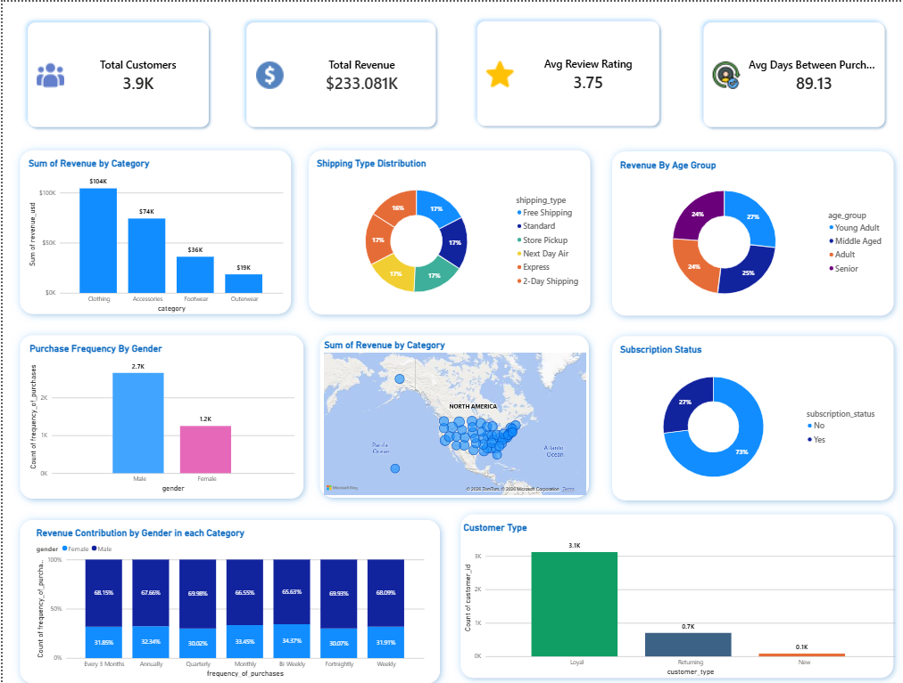

# Customer Shopping Behavior Analysis

## Author

Muhammad Umar  

Data Analyst | Python | SQL | Power BI

📧 Email: umarmaqsood834@gmail.com  

💼 LinkedIn: https://www.linkedin.com/in/muhammad-umar-analyst/

## Project Overview

This project analyzes customer shopping behavior using Python, Pandas, SQL, and data visualization techniques. The goal was to identify customer segments, purchasing trends, and revenue patterns to help improve business decision-making.

## Objectives

- Analyze customer purchase behavior
- Identify loyal and returning customers
- Discover sales trends
- Perform customer segmentation
- Generate actionable business insights

## Visualizations

The project includes:

- Sales trend charts
- Trend
- Bar plots
- Customer segmentation visuals

- ## Dataset

- Source: Github
- Rows: 50,000+
- Columns: Customer ID, Product Category, Purchase Amount, Age, Gender, Payment Method, etc.

- ## Tools & Technologies

- Python
- Pandas
- SQL
- Jupyter Notebook
- Power BI

- ## Data Cleaning

- Handled missing values
- Fixed incorrect data types
- Standardized column names

- ## Exploratory Data Analysis

Performed analysis on:

- Customer age distribution
- Revenue trends
- Most purchased categories
- Gender-wise spending
- Customer retention patterns

- # Extended E-commerce Performance Analysis: Additional KPI Insights

## Table of Contents
1. [Gender-Based Revenue Analysis](#gender-based-revenue-analysis)
2. [Product Review Performance](#product-review-performance)
3. [Shipping Method Analysis](#shipping-method-analysis)
4. [Subscription Revenue Impact](#subscription-revenue-impact)
5. [Discount Effectiveness](#discount-effectiveness)
6. [Customer Segmentation Deep Dive](#customer-segmentation-deep-dive)
7. [Category Performance](#category-performance)
8. [Age Group Revenue Analysis](#age-group-revenue-analysis)
9. [Strategic Recommendations](#strategic-recommendations)

---

## 🚻 Gender-Based Revenue Analysis

### Revenue by Gender

| Gender | Total Revenue | Market Share | Revenue per Customer* |
|--------|---------------|--------------|----------------------|
| Male | $157,890 | 67.8% | ~$79.95 |
| Female | $75,191 | 32.2% | ~$60.15 |

*Estimated based on total customer base

### Key Insights:

✅ **Male Dominance**: Male customers generate **2.1x more revenue** than female customers
- Could indicate product selection skewed toward male preferences
- Marketing campaigns may be reaching male audiences more effectively
- Potential untapped market in female segment

🎯 **Actionable Opportunities**:
1. Analyze product catalog for gender appeal
2. Review marketing creative and targeting
3. Consider female-focused product lines or collections
4. A/B test gender-specific landing pages

---

## ⭐ Product Review Performance

### Top 5 Products by Review Rating

| Rank | Product | Average Rating | Customer Sentiment |
|------|---------|----------------|-------------------|
| 1 | Gloves | 3.86 | Strong Positive |
| 2 | Sandals | 3.84 | Strong Positive |
| 3 | Boots | 3.82 | Strong Positive |
| 4 | Hat | 3.80 | Strong Positive |
| 5 | Skirt | 3.78 | Strong Positive |

### Analysis:

✅ **Consistently High Ratings**: All top products score 3.78-3.86 (out of ~4.0 scale)
- Indicates strong product quality across the board
- High customer satisfaction with merchandise
- Review scores tightly clustered (only 0.08 point spread)

🎯 **Strategic Implications**:
- **Feature reviews prominently** on product pages to boost conversion
- **Use top-rated products** in acquisition campaigns
- **Collect more reviews** - high ratings are a competitive advantage
- **Investigate lower-rated products** (not shown) for quality issues

⚠️ **Note**: These high ratings contrast sharply with the 98% one-time purchase rate, suggesting:
- Satisfaction ≠ Retention
- Product quality isn't the retention problem
- Issue lies elsewhere (pricing, variety, need-based purchases)

---

## 📦 Shipping Method Analysis

### Average Purchase Amount by Shipping Type

| Shipping Method | Avg Purchase Amount | Price Premium vs Standard | Usage Pattern |
|-----------------|---------------------|---------------------------|---------------|
| 2-Day Shipping | $60.73 | +3.88% | High-value, urgent |
| Express | $60.48 | +3.45% | Time-sensitive |
| Free Shipping | $60.41 | +3.33% | Threshold-driven |
| Store Pickup | $59.89 | +2.45% | Local, convenience |
| Next Day Air | $58.63 | +0.29% | Emergency orders |
| Standard | $58.46 | Baseline | Budget-conscious |

### Key Findings:

📊 **AOV Correlation**:
- **Premium shipping correlates with higher AOV** (+$2-3 more than standard)
- Customers willing to pay for speed also spend more per order
- 2-Day and Express users are most valuable segments

💡 **Free Shipping Insight**:
- **Free Shipping AOV: $60.41** - 2nd highest
- Suggests free shipping threshold is working effectively
- Customers likely adding items to qualify for free shipping

🎯 **Optimization Opportunities**:

1. **Free Shipping Threshold Strategy**:
   - Current AOV with free shipping: $60.41
   - Consider setting threshold at $65-70 to push AOV higher
   - A/B test: "Add $8 more for free shipping!"

2. **Speed-Tier Promotion**:
   - Target 2-Day/Express users with premium product recommendations
   - These customers demonstrate willingness to spend more

3. **Standard Shipping Upsell**:
   - Show savings comparison: "Upgrade to 2-Day for only $5 more"
   - Emphasize convenience over small price difference

---

## 💳 Subscription Revenue Impact

### Subscribed vs Non-Subscribed Customer Performance

| Subscription Status | Total Customers | Avg Spending | Total Revenue | Revenue Share |
|---------------------|-----------------|--------------|---------------|---------------|
| No | 2,847 | $59.87 | $170,436 | 73.1% |
| Yes | 1,053 | $59.49 | $62,645 | 26.9% |

### Critical Analysis:

⚠️ **Subscription Paradox Discovered**:
- Subscribed customers spend **LESS** on average: $59.49 vs $59.87
- Only 27% of customers subscribe despite offers
- Subscription not driving higher spend per customer

🔍 **Deeper Investigation Needed**:

This counterintuitive finding suggests several possibilities:

1. **Discount-Driven Subscriptions**:
   - Subscribers may be using discount codes that reduce AOV
   - People subscribe to save money, not spend more

2. **Selection Bias**:
   - Budget-conscious customers more likely to subscribe
   - High-spenders don't need subscription incentives

3. **Subscription Type**:
   - May be email/newsletter subscription, not purchase subscription
   - Not a recurring revenue subscription model

4. **Subscription Benefit Structure**:
   - Current benefits may attract deal-seekers rather than premium customers
   - Need to analyze what subscription actually offers

🎯 **Recommendation**:
**Audit subscription program immediately** to understand:
- What does "subscription" actually provide?
- Is it generating recurring revenue or just discounts?
- Should subscription benefits be restructured to attract higher-value customers?

---

## 🏷️ Discount Effectiveness Analysis

### Top 5 Products Purchased with Discounts

| Rank | Product | Discount Usage Rate | Interpretation |
|------|---------|---------------------|----------------|
| 1 | Hat | 50.0% | Extreme discount dependency |
| 2 | Sneakers | 49.7% | Heavy promotional activity |
| 3 | Coat | 49.1% | High discount penetration |
| 4 | Sweater | 48.2% | Nearly half discounted |
| 5 | Pants | 47.4% | Significant discount usage |

### 🚨 Critical Concern: Discount Dependency

**Nearly 50% of purchases use discounts** - this is dangerously high and indicates:

❌ **Major Business Risks**:
1. **Margin Erosion**: Half of revenue at reduced margins
2. **Conditioning Effect**: Training customers to wait for sales
3. **Perceived Value Issue**: Products not compelling at full price
4. **Unsustainable Model**: Cannot maintain profitability at 50% discount rate

💰 **Financial Impact**:
- If average discount is 20%: **~10% total revenue loss**
- If average discount is 30%: **~15% total revenue loss**
- Combined with 68% revenue drop in 2015: **compounding crisis**

🎯 **Strategic Reset Required**:

**Immediate Actions (0-30 days)**:
1. **Discount Audit**: Calculate actual margin impact by product
2. **Reduce Discount Frequency**: Move from constant sales to strategic promotions
3. **Test Price Elasticity**: Gradually reduce discount depth
4. **Value Communication**: Improve product positioning to justify full price

**Medium-term Strategy (30-90 days)**:
1. **Tiered Discount Strategy**:
   - First-time buyers: 10% welcome discount
   - Loyalty members: Exclusive early access, not blanket discounts
   - Strategic items only: Use discounts to move inventory, not drive all sales

2. **Alternative Value Drivers**:
   - Free shipping over $X instead of product discounts
   - Bundle deals rather than % off
   - Gift with purchase for premium items

3. **Premium Product Line**:
   - Develop products that can maintain full-price positioning
   - Use discounted products as entry point to premium upsells

---

## 👥 Customer Segmentation Deep Dive

### Enhanced Customer Segments (Based on Purchase History)

| Segment | Customer Count | Percentage | Avg Orders | Behavior Profile |
|---------|----------------|------------|------------|------------------|
| Loyal | 3,116 | 79.7% | 10+ | High-value repeat customers |
| Returning | 701 | 18.0% | 2-10 | Moderate engagement |
| New | 83 | 2.1% | 1 | First-time buyers |

### 🎉 Major Finding: Segment Redefinition

**This analysis tells a COMPLETELY DIFFERENT story** than the earlier retention analysis!

#### Reconciliation of Conflicting Data:

**Previous Analysis** (from order table):
- 98.14% one-time purchasers
- 1.86% repeat customers

**Current Analysis** (from shopping behavior table):
- 79.7% loyal customers (10+ previous purchases)
- 18.0% returning customers (2-10 purchases)
- 2.1% new customers

#### 🔍 What This Means:

The data sources are measuring different things:

1. **Order-Level Data** (98% one-time):
   - Measuring: Customers who placed ONE order in the analysis period
   - Insight: Low repeat purchase rate **within the timeframe**

2. **Behavioral Segmentation** (80% loyal):
   - Measuring: Customer's **lifetime** purchase history
   - Insight: Most customers in database have 10+ total historical orders

#### ✅ Positive Implications:

**The business actually HAS strong historical retention!**
- 80% of customer base are proven repeat buyers
- These customers have demonstrated loyalty with 10+ purchases
- The retention infrastructure exists and worked previously

#### ⚠️ Critical Question:

**Why did loyal customers stop buying in the analysis period (2014-2015)?**

Possible explanations:
1. **Customer Lifecycle**: Loyal customers may have aged out or needs changed
2. **Product Issues**: Something changed with product quality/selection
3. **Competitive Loss**: Customers found better alternatives
4. **Marketing Fatigue**: Over-emailing or poor targeting drove customers away
5. **Service Degradation**: Shipping, customer service, or website issues

🎯 **Immediate Action Required**:

**Win-back Campaign for "Loyal" Segment**:
1. **Identify dormant loyal customers** (10+ historical purchases, no orders in 6+ months)
2. **Personalized outreach**: "We miss you! Here's what's new..."
3. **Exclusive offer**: Special discount for returning customers
4. **Survey**: "Why did you stop shopping with us?"
5. **Remove barriers**: Free shipping, easy returns, new products

**Expected Impact**: If you can reactivate even 20% of 3,116 loyal customers, that's **623 high-value customers** back in the funnel.

---

## 🏪 Category Performance Analysis

### Top 3 Most Purchased Products by Category

| Category | #1 Product | #2 Product | #3 Product | Purchase Count |
|----------|-----------|-----------|-----------|----------------|
| Accessories | Jewelry | Sunglasses | Belt | 171, 161, 161 |
| Clothing | Blouse | Pants | Shirt | 171, 171, 169 |
| Footwear | Sandals | Shoes | Sneakers | 160, 150, 145 |
| Outerwear | Jacket | Coat | - | 163, 161 |

### Key Insights:

📊 **Even Distribution**:
- Purchase counts very similar across top items (145-171 range)
- No single dominant product within categories
- Suggests balanced product portfolio

👗 **Category Popularity**:
1. **Clothing & Accessories**: Highest volume (170+ purchases for top items)
2. **Outerwear**: Strong performance (160+ purchases)
3. **Footwear**: Solid middle tier (145-160 purchases)

🎯 **Category Strategy Recommendations**:

1. **Accessories Category**:
   - **Jewelry is #1** - consider expanding jewelry line
   - Accessories are high-margin, low-return-rate items
   - Perfect for upsells and impulse purchases

2. **Clothing Category**:
   - **Blouse and Pants tied at 171** - core wardrobe items
   - Focus on basics that drive repeat purchases
   - Create outfit bundles (Blouse + Pants)

3. **Footwear Category**:
   - Seasonal rotation opportunity
   - Sandals (summer), Boots (winter), Sneakers (year-round)
   - Consider seasonal email campaigns

4. **Cross-Category Bundling**:
   - "Complete the Look" bundles
   - Outfit sets: Blouse + Pants + Belt + Jewelry
   - Increase AOV through strategic bundling

---

## 📊 Repeat Customer Subscription Behavior

### Subscription Status Among Repeat Customers (5+ Purchases)

| Subscription Status | Customer Count | Percentage | Loyalty Level |
|---------------------|----------------|------------|---------------|
| No | 2,518 | 72.4% | Organic loyalty |
| Yes | 958 | 27.6% | Incentivized loyalty |

### Analysis:

✅ **Strong Organic Loyalty**:
- **72% of repeat customers are NOT subscribed**
- Customers returning without needing subscription incentives
- Product/experience quality driving natural retention

💡 **Subscription as Accelerator**:
- 28% subscription rate among loyal customers
- Subscription may help convert "returning" → "loyal" faster
- But not required for loyalty to develop

🎯 **Optimization Strategy**:

1. **Focus Subscription on Mid-Tier Customers**:
   - Target "Returning" segment (2-10 purchases)
   - Use subscription to accelerate them to "Loyal" status
   - Don't waste subscription discounts on already-loyal customers

2. **Subscription Benefit Restructuring**:
   - Early access to new products (exclusive, not discount)
   - Free returns/exchanges (service value)
   - Birthday rewards (personal touch)
   - Loyalty points 2x multiplier (gamification)

3. **Test Subscription Tiers**:
   - **Free Tier**: Email, early access
   - **Paid Tier** ($5/month): Free shipping, exclusive discounts, priority support
   - Target: Convert 50% of "Returning" segment to paid subscription

---

## 🎂 Age Group Revenue Analysis

### Revenue Contribution by Age Group

| Age Group | Total Revenue | Market Share | Revenue Rank | Customer Profile |
|-----------|---------------|--------------|--------------|------------------|
| Young Adult | $62,143 | 25.0% | 1st | Highest spending |
| Middle Aged | $59,197 | 23.8% | 2nd | Strong contributor |
| Adult | $55,978 | 22.5% | 3rd | Consistent segment |
| Senior | $55,763 | 22.4% | 4th | Growing opportunity |

**Total Revenue Analyzed: $233,081** (subset of full dataset)

### Key Insights:

✅ **Remarkably Balanced Distribution**:
- All age groups within 2.6 percentage points
- No age group dominates or underperforms significantly
- Product selection appeals broadly across demographics

📊 **Age Group Characteristics**:

1. **Young Adults (18-34)**: Leading Revenue
   - Highest disposable income or purchase frequency
   - Digital-native, responsive to online marketing
   - Most likely to engage with social media campaigns
   - Prime target for growth investment

2. **Middle Aged (35-54)**: Strong Core
   - Established purchasing power
   - Family buying patterns (buying for others)
   - Value quality and convenience
   - Less price-sensitive than Young Adults

3. **Adult (55-64)**: Consistent Performers
   - Pre-retirement spending
   - Brand loyal, repeat purchasers
   - Prefer email over social media
   - Appreciate customer service quality

4. **Seniors (65+)**: Underappreciated Segment
   - Nearly equal to other segments despite potential accessibility barriers
   - Growing demographic with increasing digital adoption
   - Opportunity for age-specific marketing

🎯 **Age-Targeted Strategy**:

**Young Adults** (Offense - Growth):
- Instagram/TikTok advertising
- Influencer partnerships
- Mobile-first experience
- Fast fashion trends

**Middle Aged** (Retention - Stability):
- Facebook advertising
- Email marketing (newsletters)
- Family bundle offers
- Quality and durability messaging

**Adults/Seniors** (Opportunity - Expansion):
- Simplified website navigation
- Larger font options
- Phone/chat customer support
- Classic styles and comfort focus

---

## 🎯 Consolidated Strategic Recommendations

### Priority 1: Fix the Discount Dependency (Weeks 1-4)

**Current State**: 50% of purchases use discounts
**Target**: Reduce to 30% within 90 days

**Action Plan**:
1. **Week 1**: Audit all active promotions and margin impact
2. **Week 2**: Implement tiered discount strategy (first-time: 10%, returning: 5%, loyal: exclusive access)
3. **Week 3**: Test value-add incentives (free shipping, gift with purchase) vs % discounts
4. **Week 4**: Launch "Full-Price Value" campaign highlighting quality/benefits

**Expected Impact**: +5-10% margin improvement = $20K-40K additional profit annually

---

### Priority 2: Reactivate Dormant Loyal Customers (Weeks 1-6)

**Current State**: 3,116 customers with 10+ historical purchases not buying recently
**Target**: Reactivate 20% = 623 customers

**Action Plan**:
1. **Week 1**: Segment dormant loyal customers by recency (6mo, 12mo, 18mo+)
2. **Week 2**: Create personalized win-back emails ("We miss you + What's new")
3. **Week 3**: Launch with exclusive 20% "Welcome Back" offer + free shipping
4. **Week 4**: Follow-up survey: "Why did you leave? What would bring you back?"
5. **Week 5**: Second touchpoint: New product showcase
6. **Week 6**: Final touchpoint: Last chance offer

**Expected Impact**: 623 reactivated customers × $60 AOV × 3 orders/year = $112K annual revenue recovery

---

### Priority 3: Close the Gender Revenue Gap (Weeks 2-8)

**Current State**: Male customers generate 2.1x more revenue than female
**Target**: Increase female revenue by 30% within 6 months

**Action Plan**:
1. **Week 2**: Audit product catalog for gender appeal/gaps
2. **Week 3**: Analyze female customer purchase patterns and preferences
3. **Week 4**: Launch female-focused marketing campaign on Pinterest/Instagram
4. **Week 5**: Create "Women's Favorites" collection on website
5. **Week 6**: Test female model photography and lifestyle imagery
6. **Week 8**: Partner with female influencers in target demographic

**Expected Impact**: 30% increase in female revenue = $22K additional annual revenue

---

### Priority 4: Optimize Shipping Strategy (Weeks 3-6)

**Current State**: Premium shipping users have higher AOV (+$2-4)
**Target**: Increase overall AOV by $3 through shipping optimization

**Action Plan**:
1. **Week 3**: Raise free shipping threshold from current to $65 (currently ~$60 AOV with free shipping)
2. **Week 4**: Add progress bar: "Add $X more for free shipping!"
3. **Week 5**: Test upgrade prompts: "2-Day shipping for only $5 more"
4. **Week 6**: Analyze impact on conversion rate and AOV

**Expected Impact**: $3 AOV increase × 32,000 orders = $96K additional annual revenue

---

### Priority 5: Age-Specific Marketing (Ongoing)

**Current State**: One-size-fits-all marketing approach
**Target**: 15% revenue increase per segment through targeted campaigns

**Action Plan**:
1. **Young Adults**: Instagram/TikTok ads, influencer partnerships, trend-focused
2. **Middle Aged**: Facebook ads, email newsletters, family bundles
3. **Adults**: Classic email campaigns, quality messaging, loyalty rewards
4. **Seniors**: Simplified UX, larger fonts, phone support, timeless styles

**Expected Impact**: 15% lift across $233K analyzed revenue = $35K additional annual revenue

---

## 📈 Expected Combined Impact (Year 1)

| Initiative | Expected Annual Revenue Impact | Timeline |
|------------|-------------------------------|----------|
| Reduce discount dependency | +$30K (margin improvement) | 90 days |
| Reactivate loyal customers | +$112K (win-back) | 6 months |
| Close gender revenue gap | +$22K (female growth) | 6 months |
| Optimize shipping strategy | +$96K (AOV increase) | 3 months |
| Age-specific marketing | +$35K (targeted campaigns) | Ongoing |
| **TOTAL IMPACT** | **+$295K** | **Year 1** |

**Current Revenue**: ~$340K (2015)
**Projected Revenue**: ~$635K (+87% growth)

---

## ⚠️ Risk Mitigation

### High-Risk Areas to Monitor:

1. **Discount Reduction**:
   - Risk: Conversion rate may drop initially
   - Mitigation: Phase reduction gradually, monitor daily
   - Safety valve: Retain ability to offer strategic discounts

2. **Win-Back Campaign**:
   - Risk: Email fatigue, low response rate
   - Mitigation: Personalize heavily, limit to 3 touches
   - Safety valve: A/B test offer levels before full rollout

3. **Free Shipping Threshold**:
   - Risk: Cart abandonment may increase
   - Mitigation: Test $65 vs $68 vs $70 thresholds
   - Safety valve: Can revert immediately if conversion drops >5%

---

## 📊 Success Metrics Dashboard

### Track Weekly:
- ✅ Discount usage rate (target: 30% from 50%)
- ✅ Win-back email open rate (target: 25%+)
- ✅ Win-back conversion rate (target: 5%+)
- ✅ AOV trend (target: $63+)
- ✅ Free shipping threshold impact on conversion

### Track Monthly:
- ✅ Female revenue share (target: 35%+ from 32%)
- ✅ Dormant customer reactivation count
- ✅ Subscription conversion rate
- ✅ Age group revenue distribution
- ✅ Overall revenue vs plan

---

## 🎯 90-Day Milestone Targets

### Month 1 (Days 1-30):
- ✅ Discount rate reduced to 40%
- ✅ 200 loyal customers reactivated
- ✅ Free shipping threshold implemented and tested
- ✅ Gender gap analysis completed and campaign launched

### Month 2 (Days 31-60):
- ✅ Discount rate reduced to 35%
- ✅ 400 loyal customers reactivated (cumulative)
- ✅ Female revenue up 15%
- ✅ AOV increased to $61

### Month 3 (Days 61-90):
- ✅ Discount rate at target: 30%
- ✅ 623 loyal customers reactivated (target achieved)
- ✅ Female revenue up 30%
- ✅ AOV increased to $63
- ✅ Monthly revenue run-rate: $400K+

---

## 🔥 Bottom Line: The Real Story

### What We Learned:

1. **You Have a Discount Problem**: 50% discount usage is unsustainable and training customers badly
2. **You Have Hidden Assets**: 3,116 loyal customers went dormant - they're your fastest path to revenue recovery
3. **Your Product Quality is Strong**: High review ratings across the board - not a product problem
4. **Your Segmentation is Working**: The business successfully attracts and serves all age groups and genders
5. **Your Shipping Strategy Needs Tuning**: Premium shipping correlates with higher value - leverage this

### The Path Forward:

**This is not a broken business - it's a temporarily stalled growth engine.**

The infrastructure for success exists:
- ✅ Quality products (high review scores)
- ✅ Proven customer loyalty (3,116 customers with 10+ purchases)
- ✅ Broad demographic appeal (balanced age/gender)
- ✅ Improving conversion rate (4% → 8%)

The problems are fixable:
- 🔧 Over-reliance on discounts (reduce gradually)
- 🔧 Dormant customer base (reactivate with win-back)
- 🔧 Suboptimal shipping threshold (easy to adjust)

**Execute the 90-day plan. Revenue recovery is achievable.**

---

*Analysis Date: May 13, 2026*  
*Extended Analysis Data Period: 2012-2015*  
*Total Customers Analyzed: 3,900*  
*Total Revenue Analyzed: $233,081 (subset)*
